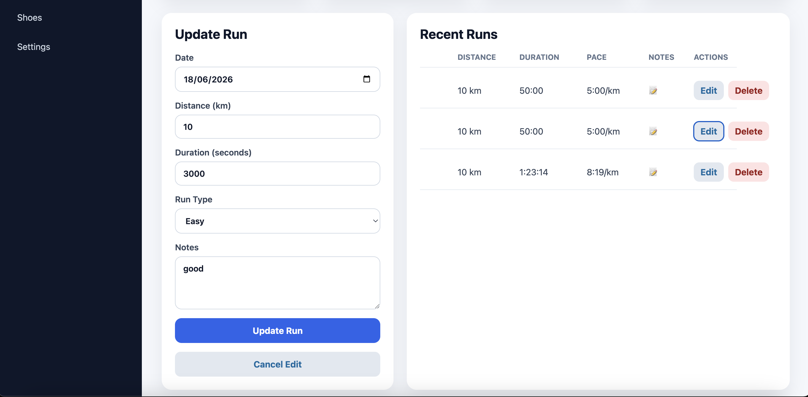
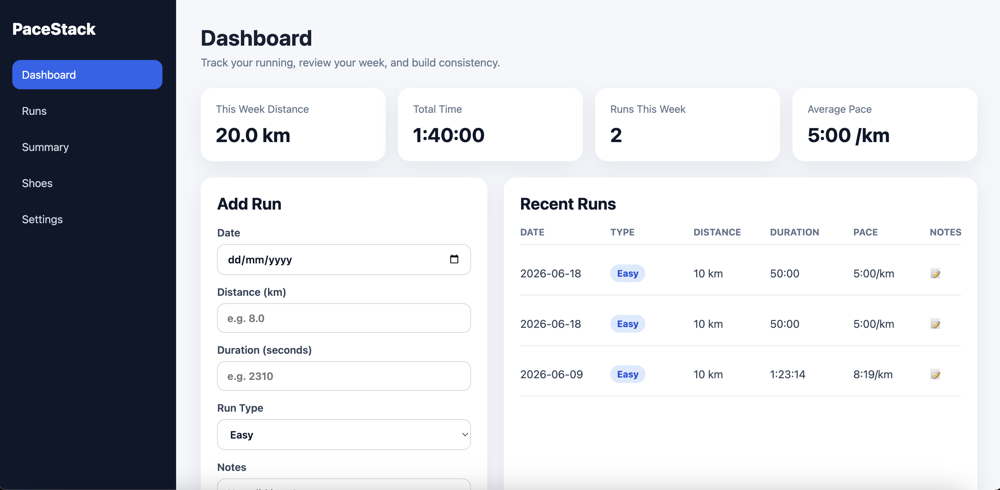

# PaceStack

PaceStack is a full-stack running log application built with React, Spring Boot, and MySQL.

The app allows runners to record training runs, view recent running history, edit and delete runs, and see useful weekly training metrics such as total distance, total time, number of runs, and average pace.

## Current Version

v1.0.0 - MVP release

## Tech Stack

### Frontend

- React
- Vite
- JavaScript
- CSS

### Backend

- Java
- Spring Boot
- Spring Web
- Spring Data JPA
- Hibernate

### Database

- MySQL

### Tools

- Git
- GitHub
- IntelliJ IDEA
- VS Code
- Postman

## Features

- Add new runs
- View recent runs
- Edit existing runs
- Delete runs
- Confirm before deleting a run
- Format run duration into readable time
- Calculate and display pace for each run
- Sort recent runs newest first
- Display weekly dashboard stats:
  - This week's total distance
  - This week's total running time
  - Runs this week
  - Average pace
- Show user-friendly run type labels
- Show notes icon instead of long notes text in the run table
- Preview notes using a tooltip
- Reuse the Add Run form for editing
- Show different form heading and button text when editing
- Cancel edit mode
- Responsive layout cleanup to prevent horizontal page scrolling

## System Design / Architecture

PaceStack uses a full-stack client-server architecture.

The React frontend is responsible for the user interface. It sends JSON requests to a Spring Boot REST API.

The Spring Boot backend follows a layered architecture:

- Controller layer: handles HTTP requests and responses
- Service layer: contains application logic
- Repository layer: handles database access
- Model/entity layer: maps Java objects to database tables

JPA and Hibernate are used to map Java entities to MySQL tables.

For example, when a user adds a run:

1. React sends a `POST` request to `/api/runs`.
2. The Spring Boot controller receives the JSON request.
3. The controller passes the data to the service layer.
4. The service layer uses the repository to save the run.
5. Hibernate writes the run to the MySQL database.
6. The saved run is returned to the frontend as JSON.
7. React reloads the run list and updates the dashboard.

## Project Structure

```text
pacestack/
├── backend/
│   └── Spring Boot backend API
├── frontend/
│   └── React frontend app
├── README.md
└── .gitignore
```

## Backend API Endpoints

### Health Check

| Method | Endpoint      | Description                     |
| ------ | ------------- | ------------------------------- |
| GET    | `/api/health` | Confirms the backend is running |

### Runs

| Method | Endpoint         | Description            |
| ------ | ---------------- | ---------------------- |
| GET    | `/api/runs`      | Get all runs           |
| GET    | `/api/runs/{id}` | Get one run by ID      |
| POST   | `/api/runs`      | Create a new run       |
| PUT    | `/api/runs/{id}` | Update an existing run |
| DELETE | `/api/runs/{id}` | Delete a run           |

## Database Setup

Create a MySQL database called:

```sql
CREATE DATABASE pacestack_db;
```

The application uses Hibernate to create and update tables automatically during local development.

The backend expects local database settings in:

```text
backend/src/main/resources/application-local.properties
```

Example:

```properties
spring.datasource.url=jdbc:mysql://localhost:3306/pacestack_db
spring.datasource.username=root
spring.datasource.password=your_mysql_password
```

This file should not be committed to GitHub.

## Backend Setup

From the `backend` folder:

```bash
./mvnw spring-boot:run
```

The backend runs at:

```text
http://localhost:8080
```

Health check:

```text
http://localhost:8080/api/health
```

Runs API:

```text
http://localhost:8080/api/runs
```

## Frontend Setup

From the `frontend` folder:

```bash
npm install
npm run dev
```

The frontend runs at:

```text
http://localhost:5173
```

## Version History

- v0.1.0 - Initial project structure
- v0.2.0 - Spring Boot backend setup
- v0.3.0 - Backend Run CRUD API
- v0.4.0 - React frontend foundation
- v0.5.0 - Frontend Add Run form connected to backend API
- v0.6.0 - Improved run display formatting
- v0.7.0 - Frontend edit and delete runs
- v0.8.0 - Pace display and weekly dashboard stats
- v0.9.0 - MVP polish and UI cleanup
- v1.0.0 - MVP release

## Future Improvements

Planned post-MVP improvements include:

- Better duration input using `mm:ss` or `hh:mm:ss`
- Full Runs page with filtering and search
- Shoe mileage tracking
- Summary and charts page
- Settings page
- User accounts and authentication with Spring Security
- AI-generated training summaries using an external API

## Status

PaceStack is currently at MVP release stage.

The app supports full CRUD functionality for runs and displays useful weekly running metrics through a React frontend connected to a Spring Boot and MySQL backend.

## Screenshots

### Dashboard



### Add and Edit Runs


